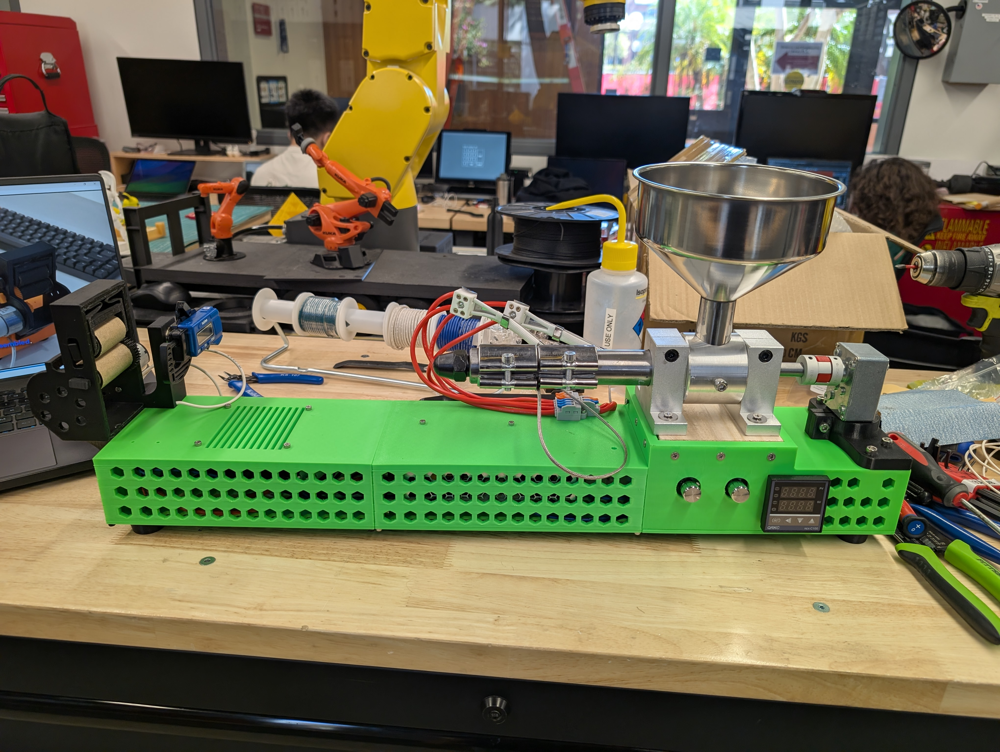
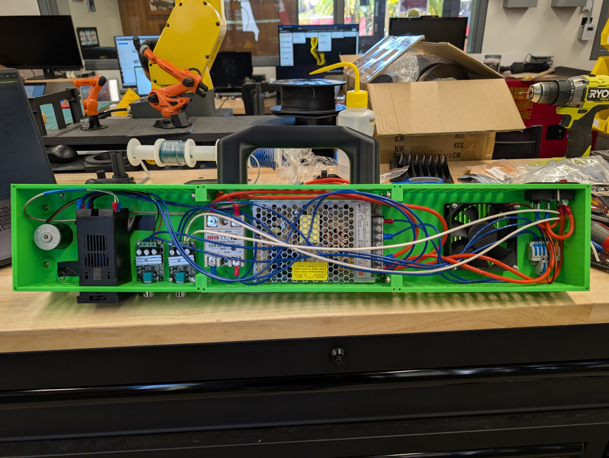

# ExtrudeX Community Operating Guide

Unofficial, community-maintained documentation for the operation, maintenance, and tuning of the ExtrudeX filament recycler.

The purpose of this repository is twofold: to enable a first-time user to operate an assembled machine safely and correctly, and to record operational knowledge gained through use in a single, version-controlled location.

**Status of all content:** every setting, procedure, and recommendation in this repository represents the *most optimal method currently known to this community*. It is expected to be superseded as better methods are found. Proposals for improvement are the intended mode of growth — see [CONTRIBUTING.md](CONTRIBUTING.md).

---

## 1. Scope and affiliation

- ExtrudeX is designed and sold by [Creative3DP](https://creative3dp.com). This repository is independent and is **not affiliated with, endorsed by, or a substitute for** Creative3DP or its products.
- This repository contains **no STL files, wiring diagrams, bills of materials, or assembly instructions** from the official ExtrudeX package. Those materials are commercially licensed; prospective builders should purchase them directly from Creative3DP.
- All content here is original documentation authored by this community, based on the operation of a legitimately purchased and assembled machine.

Full details are provided in [NOTICE.md](NOTICE.md).

## 2. Documentation index

New users should read documents 1–4 in order before operating the machine. Document 2 (Safety) is mandatory reading.

| # | Document | Contents |
|---|----------|----------|
| 1 | [Machine Overview and Principle of Operation](docs/01-how-it-works.md) | Subsystem-by-subsystem description of the extrusion process |
| 2 | [Safety](docs/02-safety.md) | Thermal, fume, mechanical, and electrical hazards; rules of operation. **Mandatory before first use.** |
| 3 | [Materials and Temperature Settings](docs/03-materials-and-temperatures.md) | Supported polymers, feedstock preparation, and current verified setpoints |
| 4 | [Operating Procedure](docs/04-operation.md) | Startup, production run, and shutdown sequences |
| 5 | [Cleaning and Maintenance](docs/05-cleaning-and-maintenance.md) | Purge procedures, per-session care, and periodic inspection schedule |
| 6 | [Troubleshooting](docs/06-troubleshooting.md) | Fault symptoms, probable causes, and documented corrective actions |
| 7 | [Experiment Log](docs/07-experiment-log.md) | Structured record of trials supporting the documented settings |

## 3. Quick reference for first-time operators

1. Read [Safety](docs/02-safety.md) in full. Barrel surface temperatures during operation cause immediate burns on contact.
2. Confirm the feedstock is a single polymer type, granulated to a uniform size, and dry.
3. Set the barrel temperature per the current verified values in [Materials and Temperature Settings](docs/03-materials-and-temperatures.md).
4. Execute the [Operating Procedure](docs/04-operation.md) in sequence.
5. Record the session outcome in the [Experiment Log](docs/07-experiment-log.md); report anomalies as issues.

## 4. Contributing

Improvements to settings and procedures are accepted via pull request and must be accompanied by supporting evidence (measurements, photographs, or test-print results). The full process and content rules are defined in [CONTRIBUTING.md](CONTRIBUTING.md).

## 5. License

The original documentation in this repository is licensed under [CC BY-SA 4.0](LICENSE). This license applies solely to the documentation authored here; it does not and cannot extend to any Creative3DP materials, which remain the property of their owner.
